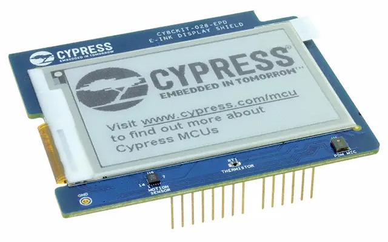

# CY8CKIT-028-EPD shield support library

The E-ink Display Shield Board (CY8CKIT-028-EPD) has been designed such that an ultra-low-power E-ink display, sensors and a microphone can interface with PSoC MCUs.

It comes with the features below to enable everyday objects to connect to the Internet of Things (IoT).

* Ultra-low-power 2.7" E-ink Display (E2271CS021)
* Motion Sensor (BMI-160)
* Temperature Sensor (NCP18XH103F03RB)
* PDM Microphone example code (SPK0838HT4HB)

The shield library provides support for:
* Initializing/freeing all of the hardware peripheral resources on the board
* Defining all pin mappings from the Arduino interface to the different peripherals
* Providing access to each of the underlying peripherals on the board

This library makes use of support libraries: [display-eink-e2271cs021](https://github.com/cypresssemiconductorco/display-eink-e2271cs021), [sensor-motion-bmi160](https://github.com/cypresssemiconductorco/sensor-motion-bmi160), and [thermistor](https://github.com/cypresssemiconductorco/thermistor). These can be seen in the libs directory and can be used directly instead of through the shield if desired.

The E-ink Display Shield Board uses the Arduino Uno pin layout, enabling this shield board to be used with the PSoC 4 and PSoC 6 MCU based Pioneer Kits.



# Quick Start Guide

* [Basic shield usage](#basic-shield-usage)
* [Display usage](https://github.com/cypresssemiconductorco/display-eink-e2271cs021#quick-start)
* [Motion Sensor usage](https://github.com/cypresssemiconductorco/sensor-motion-bmi160#quick-start)
* [Thermistor usage](https://github.com/cypresssemiconductorco/thermistor#quick-start)


## Basic shield usage
The E-ink library can be also used standalone.
Follow the steps below to create a simple application which shows an interesting pattern on the display.
1. Create an empty application
2. Add this library to the application
3. Place the following code in the main.c file:
```cpp
#include "cyhal.h"
#include "cybsp.h"
#include "cy8ckit_028_epd_pins.h"
#include "mtb_e2271cs021.h"

cyhal_spi_t spi;

const mtb_e2271cs021_pins_t pins =
{
    .spi_mosi = CY8CKIT_028_EPD_PIN_DISPLAY_SPI_MOSI,
    .spi_miso = CY8CKIT_028_EPD_PIN_DISPLAY_SPI_MISO,
    .spi_sclk = CY8CKIT_028_EPD_PIN_DISPLAY_SPI_SCLK,
    .spi_cs = CY8CKIT_028_EPD_PIN_DISPLAY_CS,
    .reset = CY8CKIT_028_EPD_PIN_DISPLAY_RST,
    .busy = CY8CKIT_028_EPD_PIN_DISPLAY_BUSY,
    .discharge = CY8CKIT_028_EPD_PIN_DISPLAY_DISCHARGE,
    .enable = CY8CKIT_028_EPD_PIN_DISPLAY_EN,
    .border = CY8CKIT_028_EPD_PIN_DISPLAY_BORDER,
    .io_enable = CY8CKIT_028_EPD_PIN_DISPLAY_IOEN,
};

uint8_t previous_frame[PV_EINK_IMAGE_SIZE] = {0};
uint8_t current_frame[PV_EINK_IMAGE_SIZE] = {0};

int main(void)
{
    cy_rslt_t result;
    uint32_t i;

    /* Initialize the device and board peripherals */
    result = cybsp_init();
    CY_ASSERT(result == CY_RSLT_SUCCESS);

    __enable_irq();

    /* Initialize SPI and EINK display */
    result = cyhal_spi_init(&spi, CY8CKIT_028_EPD_PIN_DISPLAY_SPI_MOSI,
            CY8CKIT_028_EPD_PIN_DISPLAY_SPI_MISO,
            CY8CKIT_028_EPD_PIN_DISPLAY_SPI_SCLK, NC, NULL, 8,
            CYHAL_SPI_MODE_00_MSB, false);
    if (CY_RSLT_SUCCESS == result)
    {
        result = cyhal_spi_set_frequency(&spi, 20000000);
    }

    result = mtb_e2271cs021_init(&pins, &spi);

    /* Fill the EINK buffer with an interesting pattern */
    for (i = 0; i < PV_EINK_IMAGE_SIZE; i++)
    {
        current_frame[i] = i % 0xFF;
    }

    /* Update the display */
    mtb_e2271cs021_show_frame(previous_frame, current_frame, MTB_E2271CS021_FULL_4STAGE, true);

    for (;;)
    {
    }
}
```
4. Build the application and program the kit.

### More information

* [API Reference Guide](https://cypresssemiconductorco.github.io/CY8CKIT-028-EPD/html/index.html)
* [CY8CKIT-028-EPD Documentation](https://www.cypress.com/documentation/development-kitsboards/e-ink-display-shield-board-cy8ckit-028-epd)
* [SEGGER emWin Middleware Library](https://github.com/cypresssemiconductorco/emwin)
* [Cypress Semiconductor, an Infineon Technologies Company](http://www.cypress.com)
* [Cypress Semiconductor GitHub](https://github.com/cypresssemiconductorco)
* [ModusToolbox](https://www.cypress.com/products/modustoolbox-software-environment)

---
© Cypress Semiconductor Corporation, 2019-2020.
